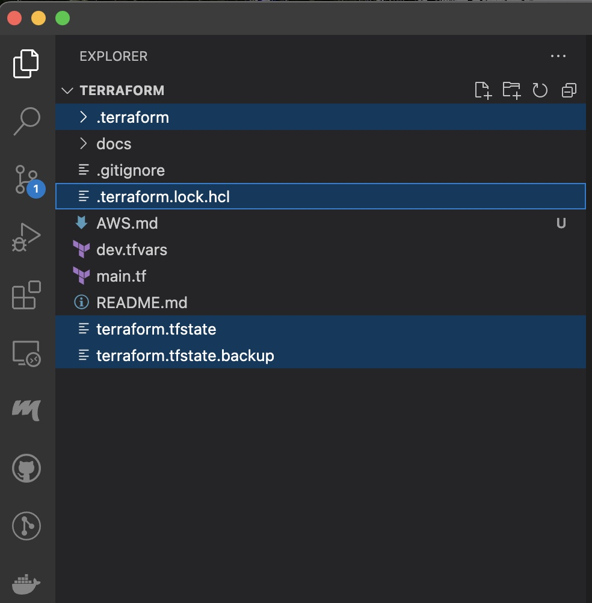
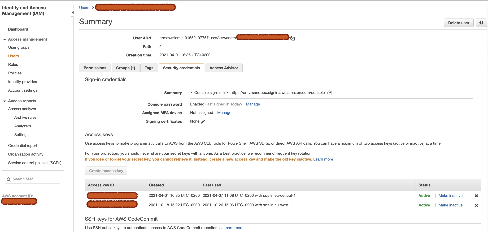
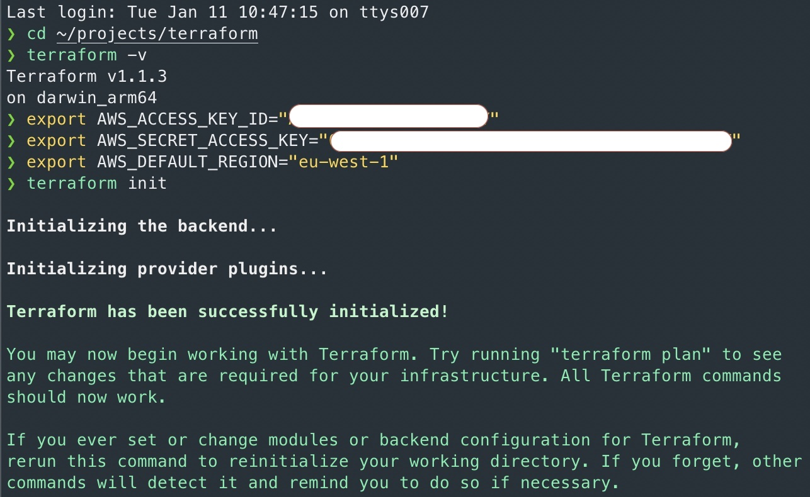
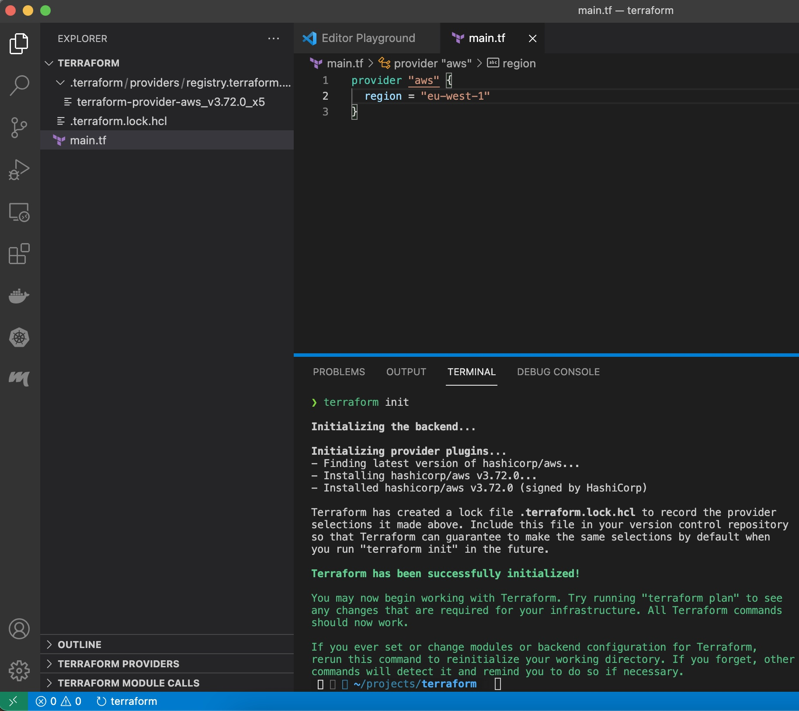
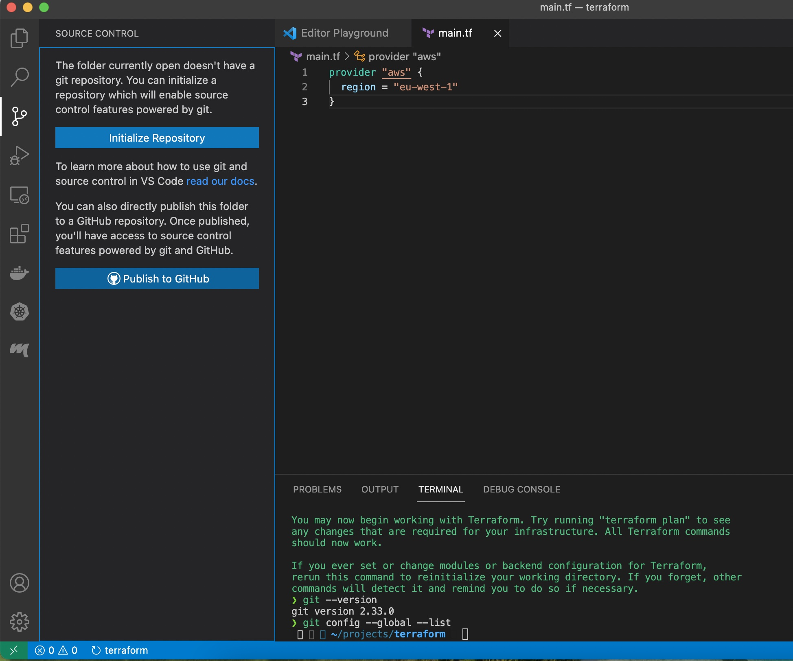
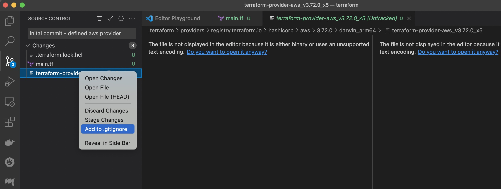
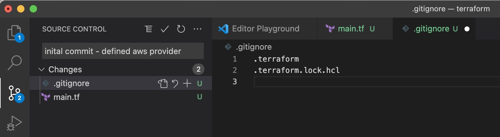
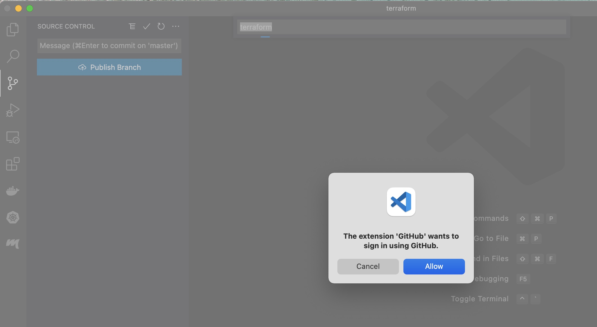
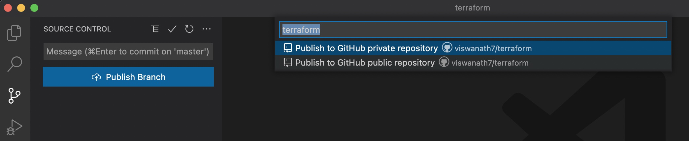
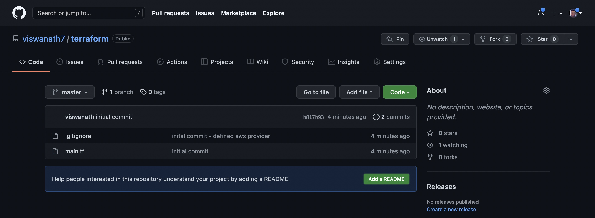

# Introduction to Terraform


## Install Terraform

On a Mac OS, one can use homebrew package manager to install Terraform as shown below
`brew install terraform`

Once installed, verify your installation by gathering the version of terraform installed.

```
❯ terraform -v
Terraform v1.1.3
on darwin_arm64
+ provider registry.terraform.io/hashicorp/aws v3.72.0

Your version of Terraform is out of date! The latest version
is 1.1.4. You can update by downloading from https://www.terraform.io/downloads.html
```

## Configure AWS provider

Provider block of the code specifies which cloud service provider, terrform shall programatically access, to automate resource management. In our case, we shall use terraform to provision infrastructure components within AWS.

```
provider "aws" {
  region = "eu-west-1"
}
```

As the terraform provider code for managing resources in AWS is not pre-shipped with terraform, it must be downloaded by issuing command `terraform init` which places resouces under `/.terraform* directory` and `terraform-provider-<provider-name>_<version-number>`



As one needs to authenticate to manage resources, populate environment variables containing user credentials, to access AWS. 



The user must possess sufficient previlege to manage resources. It is infact the same that's required for AWS CLI. 
  - AWS_SECRET_ACCESS_KEY
  - AWS_ACCESS_KEY_ID
  - AWS_DEFAULT_REGION



As the region is NOT a sensitive information, in our case, we have specified it in plain text, within provider block. 



Verify the population of environment variables by issuing the command `env | grep AWS`

Alternatively, if one would like to globally supply credentials, `~/.aws/credentials` can also be used, but note that environment variables take precedence. AWS configuration files in home directory of the user is typically created using `aws configure` command.

For more information, please refer to https://registry.terraform.io/providers/hashicorp/aws/latest/docs

---

## Using VS code, publish the project in github

Follow the steps as shown in the pictures below 
* Initialise GIT repository
  * 
* Ignore terraform files
  * 
* Commit files
  * 
* Add VS code extension
  * 
* Publish comitted files via VS code extension 
  * 
* Verify published files 
  * 

---
## Create VPC and subnets 

Gather the current state by issuing 

```
> terraform state list
```

 ###  Create VPC


Reference: https://registry.terraform.io/providers/hashicorp/aws/latest/docs/resources/vpc

```
resource "aws_vpc" "playground" {
  cidr_block = "10.0.0.0/16"
  tags = {
    Name = "playground"
  }
}
```

```

❯ terraform apply

Terraform used the selected providers to generate the following execution plan. Resource actions are indicated with the following symbols:
  + create

Terraform will perform the following actions:

  # aws_vpc.playground will be created
  + resource "aws_vpc" "playground" {
      + arn                                  = (known after apply)
      + cidr_block                           = "10.0.0.0/16"
      + default_network_acl_id               = (known after apply)
      + default_route_table_id               = (known after apply)
      + default_security_group_id            = (known after apply)
      + dhcp_options_id                      = (known after apply)
      + enable_classiclink                   = (known after apply)
      + enable_classiclink_dns_support       = (known after apply)
      + enable_dns_hostnames                 = (known after apply)
      + enable_dns_support                   = true
      + id                                   = (known after apply)
      + instance_tenancy                     = "default"
      + ipv6_association_id                  = (known after apply)
      + ipv6_cidr_block                      = (known after apply)
      + ipv6_cidr_block_network_border_group = (known after apply)
      + main_route_table_id                  = (known after apply)
      + owner_id                             = (known after apply)
      + tags                                 = {
          + "Name" = "playground"
        }
      + tags_all                             = {
          + "Name" = "playground"
        }
    }

Plan: 1 to add, 0 to change, 0 to destroy.

Do you want to perform these actions?
  Terraform will perform the actions described above.
  Only 'yes' will be accepted to approve.

  Enter a value: yes

aws_vpc.playground: Creating...
aws_vpc.playground: Creation complete after 5s [id=vpc-041f969f9c64bf891]

Apply complete! Resources: 1 added, 0 changed, 0 destroyed.

```

### Create subnet

https://registry.terraform.io/providers/hashicorp/aws/latest/docs/resources/subnet

Use AWS CLI to gather all availibility zones for a region of choice as shown below

```
❯ aws ec2 describe-availability-zones --region eu-west-1
{
    "AvailabilityZones": [
        {
            "State": "available",
            "OptInStatus": "opt-in-not-required",
            "Messages": [],
            "RegionName": "eu-west-1",
            "ZoneName": "eu-west-1a",
            "ZoneId": "euw1-az1",
            "GroupName": "eu-west-1",
            "NetworkBorderGroup": "eu-west-1",
            "ZoneType": "availability-zone"
        },
        {
            "State": "available",
            "OptInStatus": "opt-in-not-required",
            "Messages": [],
            "RegionName": "eu-west-1",
            "ZoneName": "eu-west-1b",
            "ZoneId": "euw1-az2",
            "GroupName": "eu-west-1",
            "NetworkBorderGroup": "eu-west-1",
            "ZoneType": "availability-zone"
        },
        {
            "State": "available",
            "OptInStatus": "opt-in-not-required",
            "Messages": [],
            "RegionName": "eu-west-1",
            "ZoneName": "eu-west-1c",
            "ZoneId": "euw1-az3",
            "GroupName": "eu-west-1",
            "NetworkBorderGroup": "eu-west-1",
            "ZoneType": "availability-zone"
        }
    ]
}
```

In Terraform code, create a subnet within the VPC as shown below 

```
resource "aws_subnet" "playground-subnet-1" {
  vpc_id     = aws_vpc.playground.id
  cidr_block = "10.0.16.0/24"
  availability_zone = "eu-west-1a"
  tags = {
    Name = "playground-subnet-1"
  }
}
```
- In case one needs to refer to an existing resource instead of creating a brand new one, it can be accomplished by using **data** element with filter for locating the existing resource. Once located, the found resouce can be referred by using the following syntax `data.<resource-type>.<user-assigned-varaiable-name>.<property-name>`. As we are creating resources from the scratch, the following approach is NOT used in our case. 

```
data "aws_vpc" "playground-vpc" {
  filter {
    name   = "tag:Name"
    values = ["playground"]
  }
}


resource "aws_subnet" "playground-subnet-2" {
  vpc_id     = data.aws_vpc.playground-vpc.id
  cidr_block = "10.0.32.0/24"
  availability_zone = "eu-west-1b"
  tags = {
    Name = "playground-subnet-2"
  }
}
```

- Create the resources listed in the terraform configuration file **main.tf** by specifying the file that shall supply the values to variables; which is in this case *dev.tfvars*. The flag **-auto-approve** for command line execution, supresses confirmation prompts from terraform, when the resouces are created, changes or deleted. One can also preview changes using `terraform plan` command, which is executed and presented when `terraform apply` is executed.

```
❯ terraform apply -auto-approve -var-file dev.tfvars

Terraform used the selected providers to generate the following execution plan. Resource actions are indicated with the following symbols:
  + create

Terraform will perform the following actions:

  # aws_subnet.playground-subnet-1 will be created
  + resource "aws_subnet" "playground-subnet-1" {
      + arn                                            = (known after apply)
      + assign_ipv6_address_on_creation                = false
      + availability_zone                              = "eu-west-1a"
      + availability_zone_id                           = (known after apply)
      + cidr_block                                     = "10.0.16.0/24"
      + enable_dns64                                   = false
      + enable_resource_name_dns_a_record_on_launch    = false
      + enable_resource_name_dns_aaaa_record_on_launch = false
      + id                                             = (known after apply)
      + ipv6_cidr_block_association_id                 = (known after apply)
      + ipv6_native                                    = false
      + map_public_ip_on_launch                        = false
      + owner_id                                       = (known after apply)
      + private_dns_hostname_type_on_launch            = (known after apply)
      + tags                                           = {
          + "Name" = "acme-corp-first-subnet"
        }
      + tags_all                                       = {
          + "Name" = "acme-corp-first-subnet"
        }
      + vpc_id                                         = (known after apply)
    }

  # aws_subnet.playground-subnet-2 will be created
  + resource "aws_subnet" "playground-subnet-2" {
      + arn                                            = (known after apply)
      + assign_ipv6_address_on_creation                = false
      + availability_zone                              = "eu-west-1b"
      + availability_zone_id                           = (known after apply)
      + cidr_block                                     = "10.0.32.0/24"
      + enable_dns64                                   = false
      + enable_resource_name_dns_a_record_on_launch    = false
      + enable_resource_name_dns_aaaa_record_on_launch = false
      + id                                             = (known after apply)
      + ipv6_cidr_block_association_id                 = (known after apply)
      + ipv6_native                                    = false
      + map_public_ip_on_launch                        = false
      + owner_id                                       = (known after apply)
      + private_dns_hostname_type_on_launch            = (known after apply)
      + tags                                           = {
          + "Name" = "acme-corp-second-subnet"
        }
      + tags_all                                       = {
          + "Name" = "acme-corp-second-subnet"
        }
      + vpc_id                                         = (known after apply)
    }

  # aws_subnet.playground-subnet-3 will be created
  + resource "aws_subnet" "playground-subnet-3" {
      + arn                                            = (known after apply)
      + assign_ipv6_address_on_creation                = false
      + availability_zone                              = "eu-west-1c"
      + availability_zone_id                           = (known after apply)
      + cidr_block                                     = "10.0.48.0/24"
      + enable_dns64                                   = false
      + enable_resource_name_dns_a_record_on_launch    = false
      + enable_resource_name_dns_aaaa_record_on_launch = false
      + id                                             = (known after apply)
      + ipv6_cidr_block_association_id                 = (known after apply)
      + ipv6_native                                    = false
      + map_public_ip_on_launch                        = false
      + owner_id                                       = (known after apply)
      + private_dns_hostname_type_on_launch            = (known after apply)
      + tags                                           = {
          + "Name" = "acme-corp-third-subnet"
        }
      + tags_all                                       = {
          + "Name" = "acme-corp-third-subnet"
        }
      + vpc_id                                         = (known after apply)
    }

  # aws_vpc.playground will be created
  + resource "aws_vpc" "playground" {
      + arn                                  = (known after apply)
      + cidr_block                           = "10.0.0.0/16"
      + default_network_acl_id               = (known after apply)
      + default_route_table_id               = (known after apply)
      + default_security_group_id            = (known after apply)
      + dhcp_options_id                      = (known after apply)
      + enable_classiclink                   = (known after apply)
      + enable_classiclink_dns_support       = (known after apply)
      + enable_dns_hostnames                 = (known after apply)
      + enable_dns_support                   = true
      + id                                   = (known after apply)
      + instance_tenancy                     = "default"
      + ipv6_association_id                  = (known after apply)
      + ipv6_cidr_block                      = (known after apply)
      + ipv6_cidr_block_network_border_group = (known after apply)
      + main_route_table_id                  = (known after apply)
      + owner_id                             = (known after apply)
      + tags                                 = {
          + "Name" = "acme-corp"
        }
      + tags_all                             = {
          + "Name" = "acme-corp"
        }
    }

Plan: 4 to add, 0 to change, 0 to destroy.

Changes to Outputs:
  + combined-local-variable = "playground-subnet"
  + vpc-arn                 = (known after apply)
  + vpc-first-subnet-arn    = (known after apply)
  + vpc-second-subnet-arn   = (known after apply)
  + vpc-third-subnet-arn    = (known after apply)
aws_vpc.playground: Creating...
aws_vpc.playground: Creation complete after 5s [id=vpc-0fc984705e17df04d]
aws_subnet.playground-subnet-3: Creating...
aws_subnet.playground-subnet-2: Creating...
aws_subnet.playground-subnet-1: Creating...
aws_subnet.playground-subnet-3: Creation complete after 4s [id=subnet-0d301e0e7399b3f4a]
aws_subnet.playground-subnet-2: Creation complete after 4s [id=subnet-05340241fa99ab457]
aws_subnet.playground-subnet-1: Creation complete after 4s [id=subnet-0437f5077a94d7b14]

Apply complete! Resources: 4 added, 0 changed, 0 destroyed.

Outputs:

combined-local-variable = "playground-subnet"
vpc-arn = "arn:aws:ec2:eu-west-1:191652197757:vpc/vpc-0fc984705e17df04d"
vpc-first-subnet-arn = "arn:aws:ec2:eu-west-1:191652197757:subnet/subnet-0437f5077a94d7b14"
vpc-second-subnet-arn = "arn:aws:ec2:eu-west-1:191652197757:subnet/subnet-05340241fa99ab457"
vpc-third-subnet-arn = "arn:aws:ec2:eu-west-1:191652197757:subnet/subnet-0d301e0e7399b3f4a"
```

 - Verify whether the resources are created properly by using `terraform state` commands as shown below.


```
❯ terraform state list
aws_subnet.playground-subnet-1
aws_subnet.playground-subnet-2
aws_subnet.playground-subnet-3
aws_vpc.playground

❯ terraform state show aws_vpc.playground
# aws_vpc.playground:
resource "aws_vpc" "playground" {
    arn                              = "arn:aws:ec2:eu-west-1:191652197757:vpc/vpc-0fc984705e17df04d"
    assign_generated_ipv6_cidr_block = false
    cidr_block                       = "10.0.0.0/16"
    default_network_acl_id           = "acl-0e2278bb4fbe5d632"
    default_route_table_id           = "rtb-0ea50e0fba2833d94"
    default_security_group_id        = "sg-01c7bae1c42947227"
    dhcp_options_id                  = "dopt-f4927b91"
    enable_classiclink               = false
    enable_classiclink_dns_support   = false
    enable_dns_hostnames             = false
    enable_dns_support               = true
    id                               = "vpc-0fc984705e17df04d"
    instance_tenancy                 = "default"
    main_route_table_id              = "rtb-0ea50e0fba2833d94"
    owner_id                         = "191652197757"
    tags                             = {
        "Name" = "acme-corp"
    }
    tags_all                         = {
        "Name" = "acme-corp"
    }
}
```

Notice that the VPC is created with name and CIDR block as specified in the variables file *dev.tfvars*. 

## Custom terraform environment variables

Custom environment variables available globally can be provisioned by using TF_VAR_ prefix. For example environment variable set using `export TF_VAR_my_prop=myVal` can be referred within configuration file 
```
variable my_prop = {}
```
followed by `var.my_prop`.
